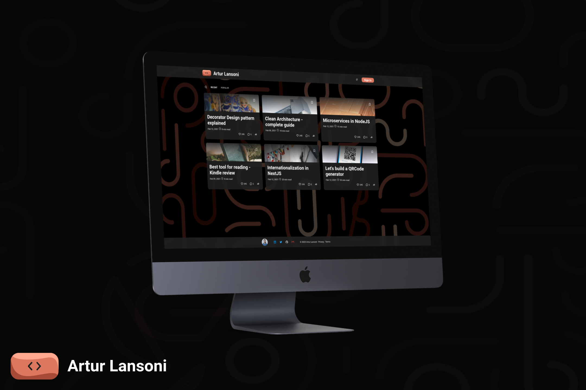

<h2 align="center">
	<a href="https://artur-lansoni.vercel.app">💻 artur-lansoni.vercel.app 📱</a>
</h2>

<h1 align="center">
	
</h1>

Idiomas: 
  <a href="../README.md">🇺🇸</a>

  <a href="#-projeto">Projeto</a>&nbsp;&nbsp;&nbsp;|&nbsp;&nbsp;&nbsp;
  <a href="#tecnologias">Tecnologias</a>&nbsp;&nbsp;&nbsp;|&nbsp;&nbsp;&nbsp;
  <a href="#-funcionalidades">Funcionalidades</a>&nbsp;&nbsp;&nbsp;|&nbsp;&nbsp;&nbsp;
  <a href="#-arquitetura">Arquitetura</a>&nbsp;&nbsp;&nbsp;|&nbsp;&nbsp;&nbsp;
  <a href="#-licença">Licença</a>

 

## 🚀 Projeto

Esse projeto é um blog / portifólio que criei para compartilhar meus conhecimentos e ao mesmo tempo mostrar minhas habilidades. Então uso essa aplicação para treinar algumas das melhores praticas de desenvolvimento de software e tambem experimentar novas tecnologias que venho estudando.

## ⚙️ Tecnologias

- [X] [Next.js](https://nextjs.org)
- [X] [React](https://reactjs.org)
- [X] [TypeScript](https://www.typescriptlang.org)
- [X] [ChakraUI](https://chakra-ui.com)
- [X] [ESLint](https://eslint.org)
- [X] [Prettier](https://prettier.io)
- [X] [Husky](https://typicode.github.io/husky/)
- [ ] [Jest](https://jestjs.io)
- [ ] [Cypress](https://www.cypress.io)
- [ ] [Storybook](https://storybook.js.org)
- [ ] [Google Analytics]()

## 💡 Funcionalidades

- SSR
- Headless CMS
- PWA
- Metadados de SEO e tags Open Graph
- Markdown
- Internacionalização

## 🧱 Arquitetura

- Programação Orientada a Objetos
- Arquitetura limpa
- Design patterns
- Testes unitários
- Testes de integração
- Princípios SOLID
- Princípios KISS, DRY, YAGNI

 

## 📝 Licença

Este projeto está licenciado sob a licença GPL-3.0. Consulte o arquivo [LICENSE](../LICENSE) para obter detalhes.

---

Feito por <a href="https://github.com/ArturLansoni">Artur Lansoni</a> 👨‍💻
